# SpringBoot集成Flowable及其简单原理解析
## 1 绘制流程图
Flowable流程图遵循BPMN2.0规范。所以采用基于BPMN2.0规范的任意软件绘制的流程文件在Flowable中可运行。<br />
Flowable流程文件是XML格式的，文件后缀.bpmn20.xml<br />
本文以使用 flowable 自带的 flowable-ui-modeler 绘制流程图。<br />
Flowable官方针对flowable-ui-modeler模块只是提供了war下载，并且需要基于本身的用户权限，所以此处需要对流程设计器的权限模块剥离。

### 1.1 Flowable流程设计器
**环境**：<br />
springboot：2.3.12.RELEASE<br />
flowable：6.4.1

### Step1 pom文件
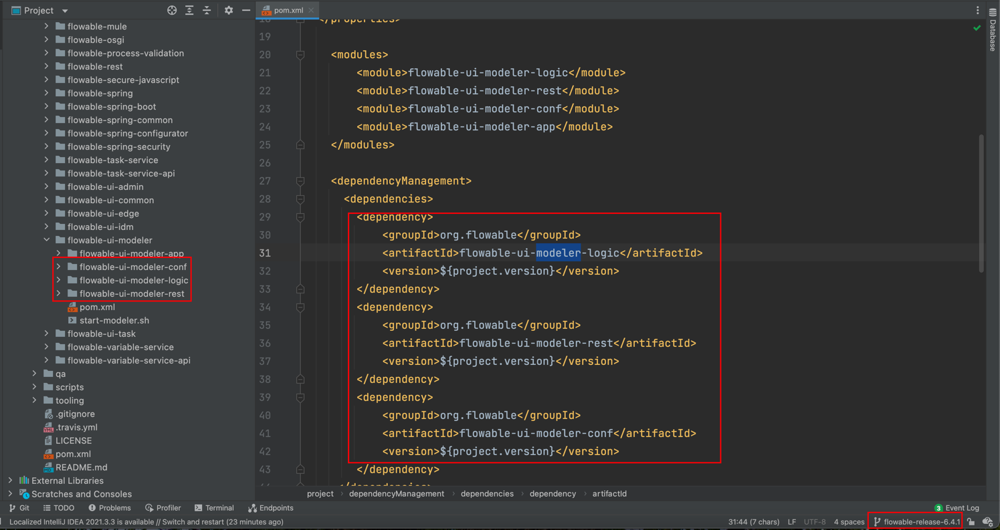
根据Flowable开源代码发现flowable-ui-modeler核心模块。
**mysql数据源**：默认是h2数据库，此处引用的是mysql数据库。
```xml
<dependencies>
    <dependency>
        <groupId>org.springframework.boot</groupId>
        <artifactId>spring-boot-starter-web</artifactId>
    </dependency>

    <!-- flowable-ui-modeler 核心 -->
    <dependency>
        <groupId>org.flowable</groupId>
        <artifactId>flowable-ui-modeler-conf</artifactId>
    </dependency>

    <dependency>
        <groupId>org.flowable</groupId>
        <artifactId>flowable-ui-modeler-rest</artifactId>
    </dependency>

    <dependency>
        <groupId>org.flowable</groupId>
        <artifactId>flowable-ui-modeler-logic</artifactId>
    </dependency>

    <!-- 替换数据源 -->
    <dependency>
        <groupId>org.springframework.boot</groupId>
        <artifactId>spring-boot-starter-jdbc</artifactId>
    </dependency>

    <dependency>
        <groupId>mysql</groupId>
        <artifactId>mysql-connector-java</artifactId>
    </dependency>
</dependencies>
```

### Step2 静态资源及配置文件
**1）从源码制相关的静态资源及配置文件**
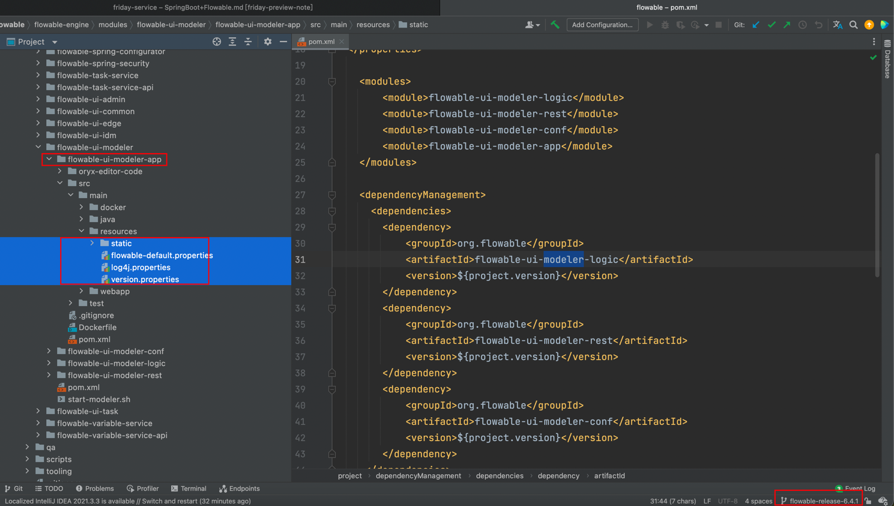

**2）自定义配置文件**
```yaml
#会覆盖flowable-default.properties的配置
server:
  port: 8081
spring:
  datasource:
    driver-class-name: com.mysql.jdbc.Driver
    username: root
    password: 123456
    url: jdbc:mysql://127.0.0.1:3306/friday-flowable-modeler?characterEncoding=UTF-8

logging:
  level:
    org.flowable.ui.modeler.rest.app: debug
```

### Step3 重写 flowable-ui-modeler 默认的类加载
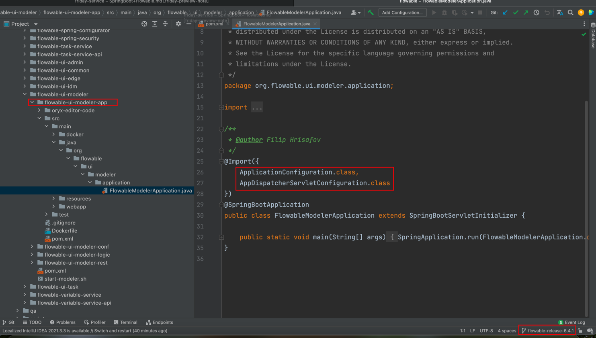
从源码中看到入口为2个类，需要对org.flowable.ui.modeler.conf.ApplicationConfiguration 进行相应的改造，剔除不需要的相关依赖，添加缺少的依赖。

**1）自定义全局配置类**
```java
package com.friday.flowable.config;

import org.flowable.ui.modeler.conf.DatabaseConfiguration;
import org.flowable.ui.modeler.properties.FlowableModelerAppProperties;
import org.flowable.ui.modeler.servlet.ApiDispatcherServletConfiguration;
import org.springframework.boot.context.properties.EnableConfigurationProperties;
import org.springframework.boot.web.servlet.ServletRegistrationBean;
import org.springframework.context.ApplicationContext;
import org.springframework.context.annotation.Bean;
import org.springframework.context.annotation.ComponentScan;
import org.springframework.context.annotation.Configuration;
import org.springframework.context.annotation.Import;
import org.springframework.web.context.support.AnnotationConfigWebApplicationContext;
import org.springframework.web.servlet.DispatcherServlet;

@Import(
        value = {
                DatabaseConfiguration.class,
        }
)
@Configuration
@EnableConfigurationProperties(FlowableModelerAppProperties.class)
@ComponentScan(basePackages = {
        "org.flowable.ui.modeler.repository",
        "org.flowable.ui.modeler.service",
        "org.flowable.ui.common.repository",
        "org.flowable.ui.common.tenant",

        "org.flowable.ui.modeler.rest.app",
        "org.flowable.ui.modeler.rest.api"
         })
public class CustomApplicationConfiguration {

    @Bean
    public ServletRegistrationBean modelerApiServlet(ApplicationContext applicationContext) {
        AnnotationConfigWebApplicationContext dispatcherServletConfiguration = new AnnotationConfigWebApplicationContext();
        dispatcherServletConfiguration.setParent(applicationContext);
        dispatcherServletConfiguration.register(ApiDispatcherServletConfiguration.class);
        DispatcherServlet servlet = new DispatcherServlet(dispatcherServletConfiguration);
        ServletRegistrationBean<DispatcherServlet> registrationBean = new ServletRegistrationBean<>(servlet, "/api/*");
        registrationBean.setName("Flowable Modeler App API Servlet");
        registrationBean.setLoadOnStartup(1);
        registrationBean.setAsyncSupported(true);
        return registrationBean;
    }
}
```
> PS: org.flowable.ui.modeler.conf.DatabaseConfiguration 为flowable源码中的mybatis配置，需要引入。

**2）重写获取用户相关信息的接口**
重写类 org.flowable.ui.common.rest.idm.remote.RemoteAccountResource，这个类是流程设计器获取用户相关信息的接口，此处的处理方式是，在新建项目中编写相同的restful接口覆盖，然后不加载原始的类。
```java
package com.friday.flowable.controller;

import org.flowable.ui.common.model.RemoteUser;
import org.flowable.ui.common.model.UserRepresentation;
import org.flowable.ui.common.security.FlowableAppUser;
import org.flowable.ui.common.security.SecurityUtils;
import org.springframework.web.bind.annotation.GetMapping;
import org.springframework.web.bind.annotation.RestController;

@RestController
public class RemoteAccountResource {

    @GetMapping("app/rest/account")
    public UserRepresentation getAccount() {
        FlowableAppUser appUser = SecurityUtils.getCurrentFlowableAppUser();
        UserRepresentation userRepresentation = new UserRepresentation(appUser.getUserObject());
        if (appUser.getUserObject() instanceof RemoteUser) {
            RemoteUser temp = (RemoteUser) appUser.getUserObject();
            userRepresentation.setPrivileges(temp.getPrivileges());
        }
        return userRepresentation;
    }
}
```

**3）重写身份管理模块实现类**
重写 org.flowable.ui.common.service.idm.RemoteIdmService ，此处在 flowable-ui-modeler-rest 模块中多次依赖注入，本处项目暂时没有使用到，所以这里采用重写空实现。
```java
package com.friday.flowable.service.impl;

import org.flowable.ui.common.model.RemoteGroup;
import org.flowable.ui.common.model.RemoteToken;
import org.flowable.ui.common.model.RemoteUser;
import org.flowable.ui.common.service.idm.RemoteIdmService;
import org.slf4j.Logger;
import org.slf4j.LoggerFactory;
import org.springframework.stereotype.Service;

import java.util.List;

@Service
public class CustomRemoteServiceImpl implements RemoteIdmService {
    private static final Logger logger = LoggerFactory.getLogger(CustomRemoteServiceImpl.class);

    @Override
    public RemoteUser authenticateUser(String s, String s1) {
        logger.debug("CustomRemoteServiceImpl:authenticateUser");
        return null;
    }

    @Override
    public RemoteToken getToken(String s) {
        logger.debug("CustomRemoteServiceImpl:getToken");
        return null;
    }

    @Override
    public RemoteUser getUser(String s) {
        logger.debug("CustomRemoteServiceImpl:getUser");
        return null;
    }

    @Override
    public List<RemoteUser> findUsersByNameFilter(String s) {
        logger.debug("CustomRemoteServiceImpl:findUsersByNameFilter");
        return null;
    }

    @Override
    public List<RemoteUser> findUsersByGroup(String s) {
        logger.debug("CustomRemoteServiceImpl:findUsersByGroup");
        return null;
    }

    @Override
    public RemoteGroup getGroup(String s) {
        logger.debug("CustomRemoteServiceImpl:getGroup");
        return null;
    }

    @Override
    public List<RemoteGroup> findGroupsByNameFilter(String s) {
        logger.debug("CustomRemoteServiceImpl:findGroupsByNameFilter");
        return null;
    }
}
```

### Step4 重写 spring-security 相关模块
在源码中 org.flowable.ui.modeler.conf.SecurityConfiguration 为流程设计器的权限核心控制，需要进行改造。本处直接基于spring-security 的运行机制重写相关的实现类，不引用原始配置的相关信息。
**1）自定义认证过滤器**
```java
package com.friday.flowable.common.filter;

import org.flowable.ui.common.security.SecurityUtils;
import org.slf4j.Logger;
import org.slf4j.LoggerFactory;
import org.springframework.security.authentication.UsernamePasswordAuthenticationToken;
import org.springframework.security.core.context.SecurityContextHolder;
import org.springframework.stereotype.Component;
import org.springframework.util.StringUtils;
import org.springframework.web.filter.OncePerRequestFilter;

import javax.servlet.FilterChain;
import javax.servlet.ServletException;
import javax.servlet.annotation.WebFilter;
import javax.servlet.http.HttpServletRequest;
import javax.servlet.http.HttpServletResponse;
import java.io.IOException;

@Component
@WebFilter(urlPatterns = {"/app/**", "/api/**"})
public class CustomFilter extends OncePerRequestFilter {
    private static final Logger logger = LoggerFactory.getLogger(CustomFilter.class);

    @Override
    protected void doFilterInternal(
            HttpServletRequest request, HttpServletResponse response, FilterChain filterChain
    ) throws ServletException, IOException {
        if (skipAuthenticationCheck(request)) {
            filterChain.doFilter(request, response);
            return;
        }
        logger.debug("MyFilter:doFilterInternal:" + request.getRequestURL());
        if (StringUtils.isEmpty(SecurityUtils.getCurrentUserId())) {
            logger.debug("MyFilter:doFilterInternal:校验......");
            UsernamePasswordAuthenticationToken token = new UsernamePasswordAuthenticationToken("admin", "");
            SecurityContextHolder.getContext().setAuthentication(token);
        } else {
            logger.debug("MyFilter:doFilterInternal:校验通过.......");
        }

        filterChain.doFilter(request, response);
    }

    protected boolean skipAuthenticationCheck(HttpServletRequest request) {
        return request.getRequestURI().endsWith(".css") ||
                request.getRequestURI().endsWith(".js") ||
                request.getRequestURI().endsWith(".html") ||
                request.getRequestURI().endsWith(".map") ||
                request.getRequestURI().endsWith(".woff") ||
                request.getRequestURI().endsWith(".png") ||
                request.getRequestURI().endsWith(".jpg") ||
                request.getRequestURI().endsWith(".jpeg") ||
                request.getRequestURI().endsWith(".tif") ||
                request.getRequestURI().endsWith(".tiff");
    }
}
```
> PS: 过滤器必须继承于 org.springframework.web.filter.OncePerRequestFilter 而不能直接实现 javax.servlet.Filter ，不然就算注入到 spring-security容器中，也不能触发本身的权限校验。此处参考源码中的 org.flowable.ui.common.filter.FlowableCookieFilter进行改造

**2）自定义权限用户**
```java
package com.friday.flowable.service.impl;

import org.flowable.ui.common.model.RemoteUser;
import org.flowable.ui.common.security.FlowableAppUser;
import org.slf4j.Logger;
import org.slf4j.LoggerFactory;
import org.springframework.security.core.GrantedAuthority;
import org.springframework.security.core.authority.SimpleGrantedAuthority;
import org.springframework.security.core.userdetails.UserDetails;
import org.springframework.security.core.userdetails.UserDetailsService;
import org.springframework.security.core.userdetails.UsernameNotFoundException;
import org.springframework.stereotype.Service;

import java.util.ArrayList;
import java.util.Arrays;
import java.util.List;

@Service
public class CustomUserDetailsServiceImpl implements UserDetailsService {
    private static final Logger LOGGER = LoggerFactory.getLogger(CustomUserDetailsServiceImpl.class);

    private static final List<String> FLOW_ABLE_MODELER_ROLES =
            Arrays.asList("access-idm", "access-rest-api", "access-task", "access-modeler", "access-admin");

    @Override
    public UserDetails loadUserByUsername(String s) throws UsernameNotFoundException {
        LOGGER.debug("MyUserDetailsService:loadUserByUsername:认证权限.....");
        ArrayList<GrantedAuthority> authorities = new ArrayList<>();

        // 配置 flowable-modeler 权限
        FLOW_ABLE_MODELER_ROLES.parallelStream().forEach(obj -> {
            authorities.add(new SimpleGrantedAuthority(obj));
        });

        RemoteUser sourceUser = new RemoteUser();
        sourceUser.setId("123456");
        sourceUser.setFirstName("admin");
        sourceUser.setDisplayName("管理员");
        sourceUser.setPassword("123456");
        sourceUser.setPrivileges(new ArrayList<>(FLOW_ABLE_MODELER_ROLES));
        return new FlowableAppUser(sourceUser, "admin", authorities);
    }
}
```
> SecurityUtils 调用的时候 FlowableAppUser 才会返回，所以在重写 org.springframework.security.core.userdetails.UserDetailsService 实现类的时候，需要使用 FlowableAppUser 作为用户类。

**3）自定义密码编译器**
```java
package com.friday.flowable.compont;


import org.slf4j.Logger;
import org.slf4j.LoggerFactory;
import org.springframework.security.crypto.password.PasswordEncoder;
import org.springframework.stereotype.Component;

@Component
public class CustomPasswordEncoder implements PasswordEncoder {
    private static final Logger logger = LoggerFactory.getLogger(CustomPasswordEncoder.class);

    @Override
    public String encode(CharSequence charSequence) {
        logger.info("CustomPasswordEncoder:encode: {}", charSequence);
        return charSequence.toString();
    }

    @Override
    public boolean matches(CharSequence frontPsw, String sourcePsw) {
        logger.info("CustomPasswordEncoder:matches, frontPsw: {}; sourcePsw: {}", frontPsw, sourcePsw);
        return true;
    }
}
```
**4）spring-security适配器配置**
```java
package com.friday.flowable.config;

import com.friday.flowable.common.filter.CustomFilter;
import org.springframework.context.annotation.Configuration;
import org.springframework.security.config.annotation.web.builders.HttpSecurity;
import org.springframework.security.config.annotation.web.configuration.WebSecurityConfigurerAdapter;
import org.springframework.security.web.context.SecurityContextPersistenceFilter;

import javax.annotation.Resource;

@Configuration
public class WebSecurityConfig extends WebSecurityConfigurerAdapter {

    @Resource
    private CustomFilter customFilter;

    @Override
    protected void configure(HttpSecurity http) throws Exception {
        http.addFilterAfter(customFilter, SecurityContextPersistenceFilter.class)
                .authorizeRequests()
                .anyRequest()
                .authenticated()
                .and().csrf().disable();//csrf 要关掉，不然前端调用会被拦截。出现 Forbidden 一闪而过的情况
    }
}
```

### 1.2 绘制流程
以请假流程为例子，其中涉及指定用户审批，动态用户审批，并行会签，串行会签，排它网关<br />
```xml
<?xml version="1.0" encoding="UTF-8"?>
<definitions xmlns="http://www.omg.org/spec/BPMN/20100524/MODEL" xmlns:xsi="http://www.w3.org/2001/XMLSchema-instance" xmlns:xsd="http://www.w3.org/2001/XMLSchema" xmlns:flowable="http://flowable.org/bpmn" xmlns:bpmndi="http://www.omg.org/spec/BPMN/20100524/DI" xmlns:omgdc="http://www.omg.org/spec/DD/20100524/DC" xmlns:omgdi="http://www.omg.org/spec/DD/20100524/DI" typeLanguage="http://www.w3.org/2001/XMLSchema" expressionLanguage="http://www.w3.org/1999/XPath" targetNamespace="http://www.flowable.org/processdef">
    <process id="leave_flow" name="请假流程" isExecutable="true">
        <documentation>请假流程</documentation>
        <startEvent id="startEvent1" name="开始"></startEvent>
        <userTask id="zz_sq" name="组长审批" flowable:candidateUsers="张三,李四"></userTask>
        <sequenceFlow id="sid-9F2FD79A-636C-40BE-A329-49D9F4D561C3" sourceRef="startEvent1" targetRef="zz_sq"></sequenceFlow>
        <userTask id="dt_sp" name="动态审批" flowable:candidateUsers="${assignee}"></userTask>
        <sequenceFlow id="sid-F6E212BE-5AC3-4B6C-BA4A-3DA3D205C11A" sourceRef="zz_sq" targetRef="dt_sp"></sequenceFlow>
        <userTask id="hq_sp_parallel" name="并行会签审批" flowable:assignee="${parallel}">
            <extensionElements>
                <modeler:initiator-can-complete xmlns:modeler="http://flowable.org/modeler"><![CDATA[false]]></modeler:initiator-can-complete>
            </extensionElements>
            <multiInstanceLoopCharacteristics isSequential="false" flowable:collection="parallelList" flowable:elementVariable="parallel">
                <completionCondition>${nrOfCompletedInstances/nrOfInstances &gt;= 0.5}</completionCondition>
            </multiInstanceLoopCharacteristics>
        </userTask>
        <sequenceFlow id="sid-51A06B9C-47F5-4DB8-959A-A00E541D336B" sourceRef="dt_sp" targetRef="hq_sp_parallel"></sequenceFlow>
        <userTask id="cx_hq_sequential" name="串行会签审批" flowable:candidateUsers="串行会签审批人A,串行会签审批人B,串行会签审批人C">
            <multiInstanceLoopCharacteristics isSequential="true">
                <loopCardinality>3</loopCardinality>
            </multiInstanceLoopCharacteristics>
        </userTask>
        <sequenceFlow id="sid-AFD6302C-B1CD-41EC-8151-E9E79D190286" sourceRef="hq_sp_parallel" targetRef="cx_hq_sequential"></sequenceFlow>
        <exclusiveGateway id="exclusive_gateway" name="排它网关"></exclusiveGateway>
        <sequenceFlow id="sid-B70BBC93-F85B-4BE7-820B-4ECC274D16AF" sourceRef="cx_hq_sequential" targetRef="exclusive_gateway"></sequenceFlow>
        <userTask id="zj_sp" name="总监审批" flowable:assignee="李总监">
            <extensionElements>
                <modeler:initiator-can-complete xmlns:modeler="http://flowable.org/modeler"><![CDATA[false]]></modeler:initiator-can-complete>
            </extensionElements>
        </userTask>
        <userTask id="zjl_sp" name="总经理审批" flowable:assignee="王经理">
            <extensionElements>
                <modeler:initiator-can-complete xmlns:modeler="http://flowable.org/modeler"><![CDATA[false]]></modeler:initiator-can-complete>
            </extensionElements>
        </userTask>
        <endEvent id="sid-5D7C6F7B-38B2-4163-8BD7-EE4297ECA3C2" name="结束"></endEvent>
        <sequenceFlow id="sid-D3BE5784-5299-4C7E-8DE2-37592BC6BBC3" sourceRef="zj_sp" targetRef="sid-5D7C6F7B-38B2-4163-8BD7-EE4297ECA3C2"></sequenceFlow>
        <sequenceFlow id="sid-3D64DAEA-90AF-4AFC-946E-9DBE7C6AC63A" sourceRef="zjl_sp" targetRef="sid-5D7C6F7B-38B2-4163-8BD7-EE4297ECA3C2"></sequenceFlow>
        <sequenceFlow id="sid-9779EFC4-01C5-4976-B32F-3924C8237023" name="小于3天" sourceRef="exclusive_gateway" targetRef="zj_sp">
            <conditionExpression xsi:type="tFormalExpression"><![CDATA[${leave_day<3}]]></conditionExpression>
        </sequenceFlow>
        <sequenceFlow id="sid-588808F8-521C-4D02-B5FE-0ED80920D766" name="大于3天" sourceRef="exclusive_gateway" targetRef="zjl_sp">
            <conditionExpression xsi:type="tFormalExpression"><![CDATA[${leave_day>=3}]]></conditionExpression>
        </sequenceFlow>
    </process>
    <bpmndi:BPMNDiagram id="BPMNDiagram_leave_flow">
        <bpmndi:BPMNPlane bpmnElement="leave_flow" id="BPMNPlane_leave_flow">
            <bpmndi:BPMNShape bpmnElement="startEvent1" id="BPMNShape_startEvent1">
                <omgdc:Bounds height="30.0" width="30.0" x="100.0" y="163.0"></omgdc:Bounds>
            </bpmndi:BPMNShape>
            <bpmndi:BPMNShape bpmnElement="zz_sq" id="BPMNShape_zz_sq">
                <omgdc:Bounds height="80.0" width="100.0" x="175.0" y="138.0"></omgdc:Bounds>
            </bpmndi:BPMNShape>
            <bpmndi:BPMNShape bpmnElement="dt_sp" id="BPMNShape_dt_sp">
                <omgdc:Bounds height="80.0" width="100.0" x="320.0" y="138.0"></omgdc:Bounds>
            </bpmndi:BPMNShape>
            <bpmndi:BPMNShape bpmnElement="hq_sp_parallel" id="BPMNShape_hq_sp_parallel">
                <omgdc:Bounds height="80.0" width="100.0" x="465.0" y="138.0"></omgdc:Bounds>
            </bpmndi:BPMNShape>
            <bpmndi:BPMNShape bpmnElement="cx_hq_sequential" id="BPMNShape_cx_hq_sequential">
                <omgdc:Bounds height="80.0" width="100.0" x="610.0" y="138.0"></omgdc:Bounds>
            </bpmndi:BPMNShape>
            <bpmndi:BPMNShape bpmnElement="exclusive_gateway" id="BPMNShape_exclusive_gateway">
                <omgdc:Bounds height="40.0" width="40.0" x="748.5" y="158.0"></omgdc:Bounds>
            </bpmndi:BPMNShape>
            <bpmndi:BPMNShape bpmnElement="zj_sp" id="BPMNShape_zj_sp">
                <omgdc:Bounds height="80.0" width="100.0" x="840.0" y="75.0"></omgdc:Bounds>
            </bpmndi:BPMNShape>
            <bpmndi:BPMNShape bpmnElement="zjl_sp" id="BPMNShape_zjl_sp">
                <omgdc:Bounds height="80.0" width="100.0" x="840.0" y="195.0"></omgdc:Bounds>
            </bpmndi:BPMNShape>
            <bpmndi:BPMNShape bpmnElement="sid-5D7C6F7B-38B2-4163-8BD7-EE4297ECA3C2" id="BPMNShape_sid-5D7C6F7B-38B2-4163-8BD7-EE4297ECA3C2">
                <omgdc:Bounds height="28.0" width="28.0" x="990.0" y="164.0"></omgdc:Bounds>
            </bpmndi:BPMNShape>
            <bpmndi:BPMNEdge bpmnElement="sid-9779EFC4-01C5-4976-B32F-3924C8237023" id="BPMNEdge_sid-9779EFC4-01C5-4976-B32F-3924C8237023">
                <omgdi:waypoint x="769.0" y="158.5"></omgdi:waypoint>
                <omgdi:waypoint x="769.0" y="115.0"></omgdi:waypoint>
                <omgdi:waypoint x="840.0" y="115.0"></omgdi:waypoint>
            </bpmndi:BPMNEdge>
            <bpmndi:BPMNEdge bpmnElement="sid-AFD6302C-B1CD-41EC-8151-E9E79D190286" id="BPMNEdge_sid-AFD6302C-B1CD-41EC-8151-E9E79D190286">
                <omgdi:waypoint x="564.9499999999907" y="178.0"></omgdi:waypoint>
                <omgdi:waypoint x="609.9999999999807" y="178.0"></omgdi:waypoint>
            </bpmndi:BPMNEdge>
            <bpmndi:BPMNEdge bpmnElement="sid-3D64DAEA-90AF-4AFC-946E-9DBE7C6AC63A" id="BPMNEdge_sid-3D64DAEA-90AF-4AFC-946E-9DBE7C6AC63A">
                <omgdi:waypoint x="939.949999999996" y="235.0"></omgdi:waypoint>
                <omgdi:waypoint x="1004.0" y="235.0"></omgdi:waypoint>
                <omgdi:waypoint x="1004.0" y="191.94994988521194"></omgdi:waypoint>
            </bpmndi:BPMNEdge>
            <bpmndi:BPMNEdge bpmnElement="sid-B70BBC93-F85B-4BE7-820B-4ECC274D16AF" id="BPMNEdge_sid-B70BBC93-F85B-4BE7-820B-4ECC274D16AF">
                <omgdi:waypoint x="709.949999999998" y="178.22912844036696"></omgdi:waypoint>
                <omgdi:waypoint x="748.9078341013825" y="178.4078341013825"></omgdi:waypoint>
            </bpmndi:BPMNEdge>
            <bpmndi:BPMNEdge bpmnElement="sid-F6E212BE-5AC3-4B6C-BA4A-3DA3D205C11A" id="BPMNEdge_sid-F6E212BE-5AC3-4B6C-BA4A-3DA3D205C11A">
                <omgdi:waypoint x="274.9499999999907" y="178.0"></omgdi:waypoint>
                <omgdi:waypoint x="319.9999999999807" y="178.0"></omgdi:waypoint>
            </bpmndi:BPMNEdge>
            <bpmndi:BPMNEdge bpmnElement="sid-51A06B9C-47F5-4DB8-959A-A00E541D336B" id="BPMNEdge_sid-51A06B9C-47F5-4DB8-959A-A00E541D336B">
                <omgdi:waypoint x="419.94999999999067" y="178.0"></omgdi:waypoint>
                <omgdi:waypoint x="464.9999999999807" y="178.0"></omgdi:waypoint>
            </bpmndi:BPMNEdge>
            <bpmndi:BPMNEdge bpmnElement="sid-9F2FD79A-636C-40BE-A329-49D9F4D561C3" id="BPMNEdge_sid-9F2FD79A-636C-40BE-A329-49D9F4D561C3">
                <omgdi:waypoint x="129.9499984899576" y="178.0"></omgdi:waypoint>
                <omgdi:waypoint x="174.9999999999917" y="178.0"></omgdi:waypoint>
            </bpmndi:BPMNEdge>
            <bpmndi:BPMNEdge bpmnElement="sid-D3BE5784-5299-4C7E-8DE2-37592BC6BBC3" id="BPMNEdge_sid-D3BE5784-5299-4C7E-8DE2-37592BC6BBC3">
                <omgdi:waypoint x="939.9499999999778" y="115.0"></omgdi:waypoint>
                <omgdi:waypoint x="1004.0" y="115.0"></omgdi:waypoint>
                <omgdi:waypoint x="1004.0" y="164.0"></omgdi:waypoint>
            </bpmndi:BPMNEdge>
            <bpmndi:BPMNEdge bpmnElement="sid-588808F8-521C-4D02-B5FE-0ED80920D766" id="BPMNEdge_sid-588808F8-521C-4D02-B5FE-0ED80920D766">
                <omgdi:waypoint x="769.0" y="197.43325971731454"></omgdi:waypoint>
                <omgdi:waypoint x="769.0" y="235.0"></omgdi:waypoint>
                <omgdi:waypoint x="839.9999999999882" y="235.0"></omgdi:waypoint>
            </bpmndi:BPMNEdge>
        </bpmndi:BPMNPlane>
    </bpmndi:BPMNDiagram>
</definitions>
```
图1：指定候选人
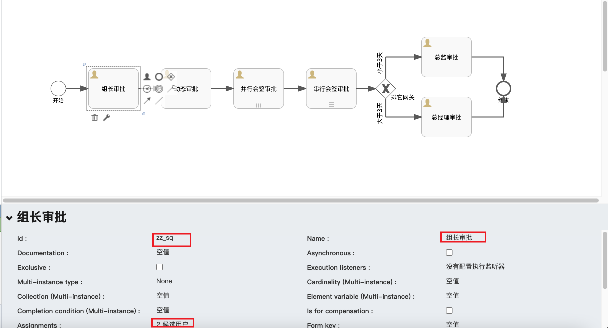
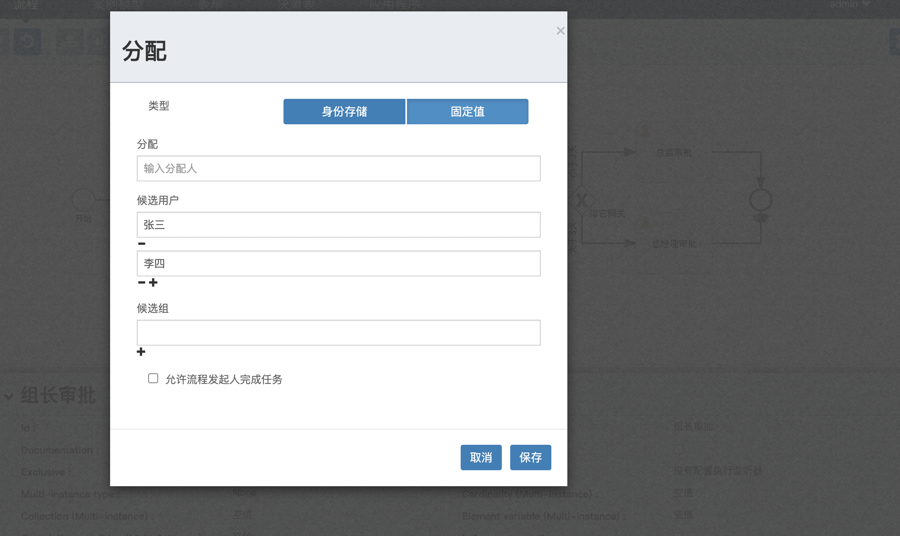
> 结合XML文件注解：<br />
> flowable:candidateUsers="张三,李四"  指定候选人，一般为用户ID，多个以逗号（,）相隔

图2：动态审批人审批
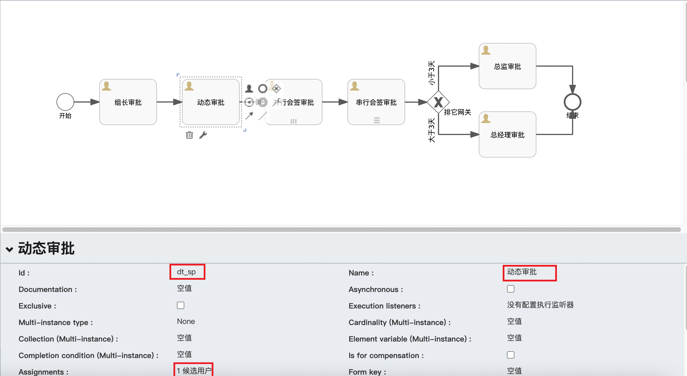
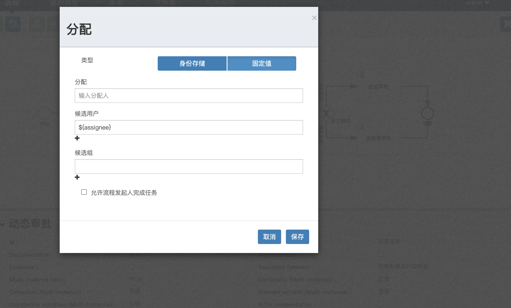
> 结合XML文件注解：<br />
> flowable:candidateUsers="${assignee}" 候选人变量，一般为用户ID，多个以逗号（,）相隔

图3：并行（parallel）会签审批（动态）
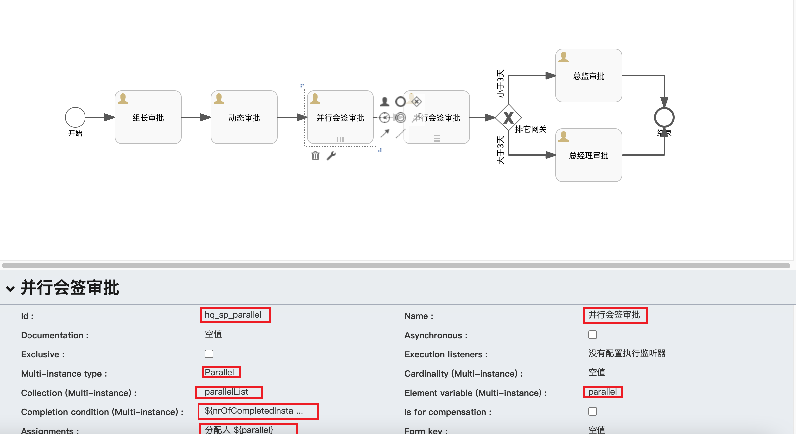

> 结合XML文件注解：<br />
> flowable:collection=“parallelList”  传入List参数,一般为用户ID集合 <br />
> flowable:elementVariable=“parallel” List中单个参数的名称 <br />
> flowable:assignee="${parallel}"     当前任务审批人变量参数 <br />

> 1 nrOfInstances 实例总数。 <br />
> 2 nrOfCompletedInstances 当前还没有完成的实例 nr是number单词缩写 。<br />
> 3 loopCounter 已经循环的次数。<br />
> 4 nrOfActiveInstances 已经完成的实例个数。<br />
> 固定数量（一人审批通过：`<completionCondition>${nrOfCompletedInstances == 1}</completionCondition>`） <br />
> 百分比（50%审批通过：`${nrOfCompletedInstances/nrOfInstances &gt;= 0.5}`） <br />

> 注：多实例并行，一次生成n(由parallelList的数量决定，如果配置的是`<loopCardinality>3</loopCardinality>`，由loopCardinality数量决定)个task，执行顺序不分先后，全部执行完这个节点才算结束

图4：串行（sequential）会签审批（指定候选人）
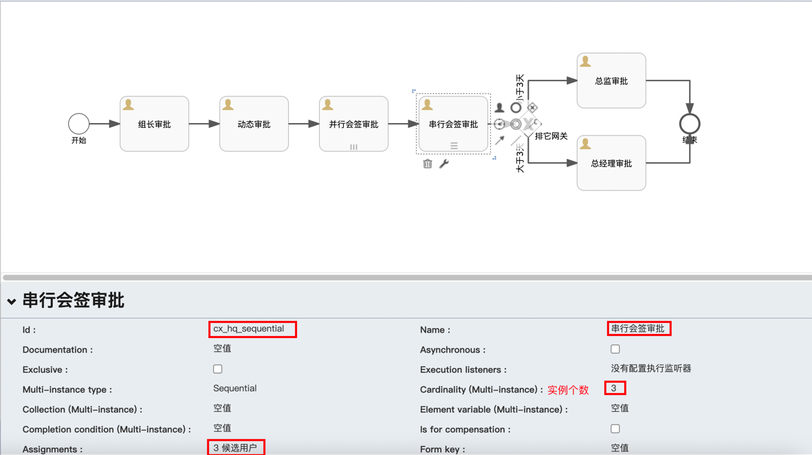
> 结合XML文件注解：<br />
> <loopCardinality>3</loopCardinality> 基数（多实例）/实例个数 <br />

> 注：多实例串行，按照顺序执行，会先生成一个task1，task1执行结束后生成一个task2，task2执行结束后在生成一个task3...

图5：排它网关分支
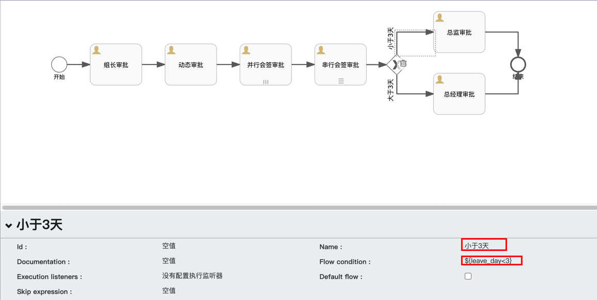
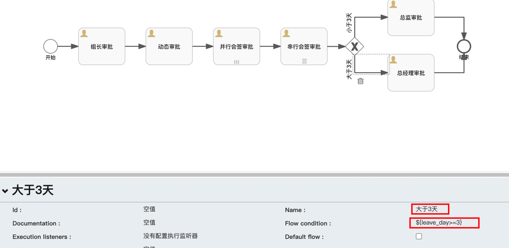

图6：指定审批人（区分与指定候选人）
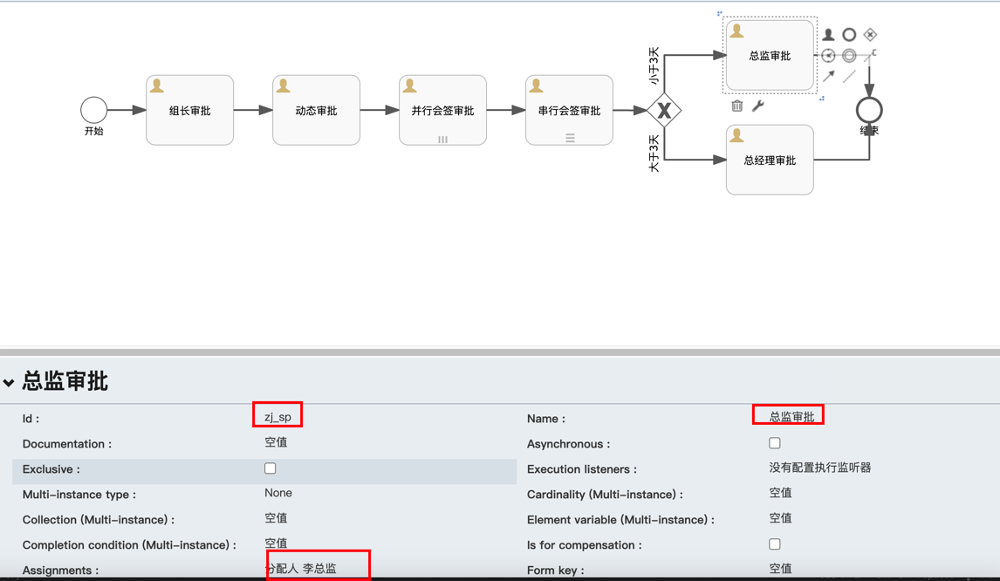

### 1.3 下载流程
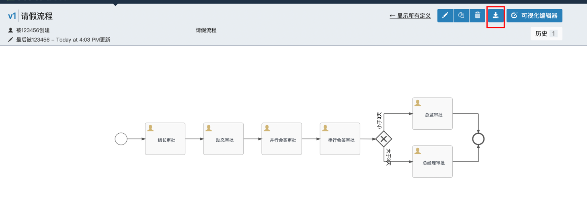

## 2 SpringBoot集成Flowable

### Step1 pom文件
```xml
<dependencies>
    <dependency>
        <groupId>org.springframework.boot</groupId>
        <artifactId>spring-boot-starter-web</artifactId>
    </dependency>

    <!-- flowable-spring-boot-starter-process -->
    <dependency>
        <groupId>org.flowable</groupId>
        <artifactId>flowable-spring-boot-starter-process</artifactId>
        <exclusions>
            <exclusion>
                <groupId>org.mybatis</groupId>
                <artifactId>mybatis</artifactId>
            </exclusion>
        </exclusions>
    </dependency>

    <dependency>
        <groupId>mysql</groupId>
        <artifactId>mysql-connector-java</artifactId>
    </dependency>

    <dependency>
        <groupId>org.mybatis.spring.boot</groupId>
        <artifactId>mybatis-spring-boot-starter</artifactId>
    </dependency>

    <dependency>
        <groupId>org.projectlombok</groupId>
        <artifactId>lombok</artifactId>
    </dependency>

    <dependency>
        <groupId>com.alibaba</groupId>
        <artifactId>fastjson</artifactId>
    </dependency>
</dependencies>
```

### Step2 配置文件
```yaml
server:
  port: 8030

spring:
  application:
    name: flowengine
  datasource:
    driver-class-name: com.mysql.jdbc.Driver
    url: jdbc:mysql://127.0.0.1:3306/friday_flowable?useUnicode=true&characterEncoding=utf8&useSSL=false&serverTimezone=GMT%2B8&allowMultiQueries=true&nullCatalogMeansCurrent=true
    username: root
    password: 123456

flowable:
  database-schema-update: false
  async-executor-activate: false
  # 保存历史数据级别设置为full最高级别，便于历史数据的追溯
  history-level: full

  # 是否开启自动部署流程定义 默认true
  check-process-definitions: false
  # 流程定义文件位置
  process-definition-location-prefix: classpath*:/bpmn/

mybatis:
  mapper-locations: classpath*:mapper/**/*.xml

# 配置log日志
logging:
  # 指定log日志文件
  config: classpath:logback.xml
```
> flowable.database-schema-update：Flowable启动时判断数据库表版本及表字段的配置，首次启动时可以打开，后期可以关闭

### Step3 初始化
运行，初始化表信息
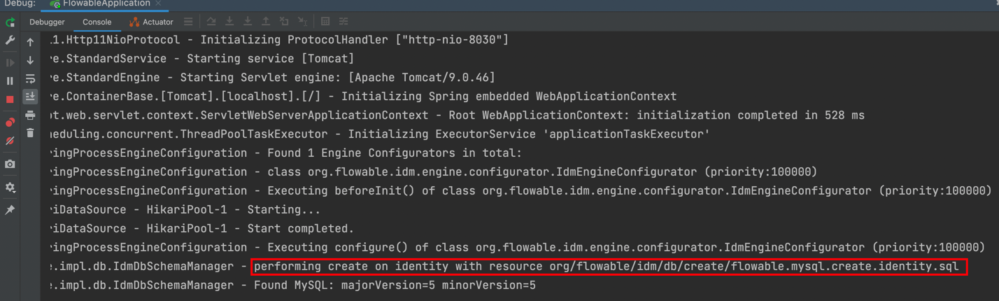

### Step4 数据库表结构说明
1、Flowable的所有数据库表都以ACT_开头。第二部分是说明表用途的两字符标示符。服务API的命名也大略符合这个规则。<br />
2、ACT_RE_: 'RE’代表repository。带有这个前缀的表包含“静态”信息，例如流程定义与流程资源（图片、规则等）。<br />
3、ACT_RU_: 'RU’代表runtime。这些表存储运行时信息，例如流程实例（process instance）、用户任务（user task）、变量（variable）、作业（job）等。Flowable只在流程实例运行中保存运行时数据，并在流程实例结束时删除记录。这样保证运行时表小和快。<br />
4、ACT_HI_: 'HI’代表history。这些表存储历史数据，例如已完成的流程实例、变量、任务等。<br />
5、ACT_GE_: 通用数据。在多处使用。<br />

> 表明细<br />
> **1）通用数据表**（2个）<br />
act_ge_bytearray：二进制数据表，如流程定义、流程模板、流程图的字节流文件；<br />
act_ge_property：属性数据表（不常用）；<br />
**2）历史表**（8个，HistoryService接口操作的表）<br />
act_hi_actinst：历史节点表，存放流程实例运转的各个节点信息（包含开始、结束等非任务节点）；<br />
act_hi_attachment：历史附件表，存放历史节点上传的附件信息（不常用）；<br />
act_hi_comment：历史意见表；<br />
act_hi_detail：历史详情表，存储节点运转的一些信息（不常用）；<br />
act_hi_identitylink：历史流程人员表，存储流程各节点候选、办理人员信息，常用于查询某人或部门的已办任务；<br />
act_hi_procinst：历史流程实例表，存储流程实例历史数据（包含正在运行的流程实例）；<br />
act_hi_taskinst：历史流程任务表，存储历史任务节点；<br />
act_hi_varinst：流程历史变量表，存储流程历史节点的变量信息；<br />
**3）用户相关表**（4个，IdentityService接口操作的表）<br />
act_id_group：用户组信息表，对应节点选定候选组信息；<br />
act_id_info：用户扩展信息表，存储用户扩展信息；<br />
act_id_membership：用户与用户组关系表；<br />
act_id_user：用户信息表，对应节点选定办理人或候选人信息；<br />
**4）流程定义、流程模板相关表**（3个，RepositoryService接口操作的表）<br />
act_re_deployment：部属信息表，存储流程定义、模板部署信息；<br />
act_re_procdef：流程定义信息表，存储流程定义相关描述信息，但其真正内容存储在act_ge_bytearray表中，以字节形式存储；<br />
act_re_model：流程模板信息表，存储流程模板相关描述信息，但其真正内容存储在act_ge_bytearray表中，以字节形式存储；<br />
**5）流程运行时表**（6个，RuntimeService接口操作的表）<br />
act_ru_task：运行时流程任务节点表，存储运行中流程的任务节点信息，重要，常用于查询人员或部门的待办任务时使用；<br />
act_ru_event_subscr：监听信息表，不常用；<br />
act_ru_execution：运行时流程执行实例表，记录运行中流程运行的各个分支信息（当没有子流程时，其数据与act_ru_task表数据是一一对应的）；<br />
act_ru_identitylink：运行时流程人员表，重要，常用于查询人员或部门的待办任务时使用；<br />
act_ru_job：运行时定时任务数据表，存储流程的定时任务信息；<br />
act_ru_variable：运行时流程变量数据表，存储运行中的流程各节点的变量信息；<br />

### Step5 <font color=#d85144> Flowable API与服务 </font>
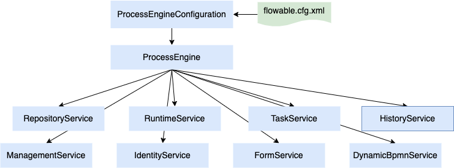
Flowable API是与Flowable交互的最常用手段。总入口点是ProcessEngine。
> 1、RepositoryService很可能是使用Flowable引擎要用的第一个服务。这个服务提供了管理与控制部署(deployments)与流程定义(process
definitions)的操作。管理静态信息。<br />
2、TaskService用于管理任务，任务审批，流转。<br />
3、RuntimeService用于启动流程定义的新流程实例。<br />
4、HistoryService暴露Flowable引擎收集的所有历史数据。要提供查询历史数据的能力。<br />
5、ManagementService通常在用Flowable编写用户应用时不需要使用。它可以读取数据库表与表原始数据的信息，也提供了对作业(job)的查询与管理操作。<br />
6、IdentityService很简单。它用于管理（创建，更新，删除，查询……）组与用户。<br />
7、FormService是可选服务。也就是说Flowable没有它也能很好地运行，而不必牺牲任何功能。<br />
8、DynamicBpmnService可用于修改流程定义中的部分内容，而不需要重新部署它。例如可以修改流程定义中一个用户任务的办理人设置，或者修改一个服务任务中的类名。<br />

### Step6 Flowable流程流转实现
参考代码模块friday-preview-flowable下的com.friday.flowable.service.impl.PreviewFlowableServer
