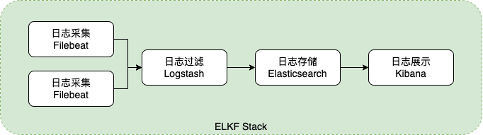
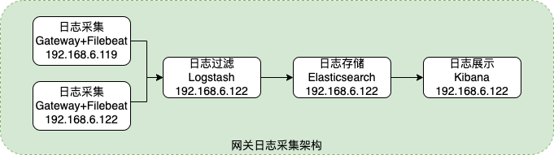
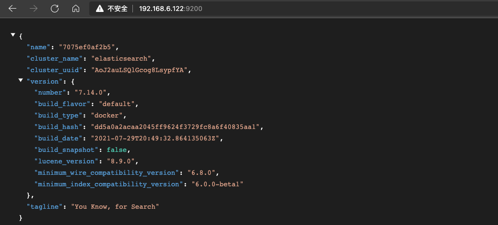

# ELK Stack
## 1 简介
ELK是一个应用套件，由Elasticsearch、Logstash、Kibana三部分组成，简称ELK。它是一套开源免费、功能强大的日志分析管理系统。ELK可以将我们的系统日志、网站日志、应用系统日志等各种日志进行收集、过滤、清洗、然后进行集中存放并可用于实时检索、分析。这三款软件都是开源软件，通常配合使用，而且又先后归于Elastic.co公司名下，故又称为ELK Stack。<br />


方案一：ELK，使用Logstash采集日志，需要项目中集成Logstash的SDK，通过Logback（或其他日志框架）配置文件配置Logstash地址等信息。日志的采集是通过HTTP的方式经过Logstash保存到ES中，这种方式对性能占用较高。



方案二：ELKF，每台服务分别将日志写入相应文件夹下，每台服务分别部署Filebeat，Filebeat采集自定文件夹下的日志推送给Logstash进行过滤，最后保存到ES中。<br />Logstash 拥有比 Filebeat 更为丰富的功能，但能力越大，背负的越多，意味着 Logstash 作为采集工具会比 Filebeat 占用更多的系统资源。其中有个依据Logstash 默认的堆内存大小是 1G，Filebeat 占用内存仅仅大概是 10M 左右。

## 2 架构



## 3 部署

| **组件**      | **服务器IP**                     | **端口** | **版本** | **部署方式** | **备注**                               |
| ------------- | -------------------------------- | -------- | -------- | ------------ | -------------------------------------- |
| Filebeat      | 192.168.6.119<br />192.168.6.122 | -        | 7.14.0   | Linux        | 日志采集，部署两台，模拟分布式部署采集 |
| Logstash      | 192.168.6.119                    | 5055     | 7.14.0   | Docker       | 日志过滤，格式化日志                   |
| Elasticsearch | 192.168.6.119                    | 9200     | 7.14.0   | Docker       | 日志存储                               |
| Kibana        | 192.168.6.119                    | 5601     | 7.14.0   | Docker       | 日志展示                               |

**依赖关系：** KIbana、Logstash依赖与Elasticsearch，Filebeat依赖于Logstash，所以按照依赖关系顺序部署。

### 3.1 Elasticsearch

#### 3.1.1 创建目录
```bash
mkdir -p /home/docker/elk/elasticsearch/{config,data,plugins}
# 配置权限，未配置情况下启动报错
chmod 777 /home/docker/elk/elasticsearch/{config,data,plugins}
```

#### 3.1.2 配置文件
`vim /home/docker/elk/elasticsearch/elasticsearch.yml`

```yaml
cluster.name: "elasticsearch"
#访问ID限定，0.0.0.0为不限制，生产环境请设置为固定IP
network.host: 0.0.0.0

#加入跨域配置
http.cors.enabled: true
http.cors.allow-origin: "*"

#异常Elasticsearch built-in security features are not enabled
xpack.security.enabled: false

#ES集群内通信地址，默认为network.host
#transport.host: 0.0.0.0

#elasticsearch节点名称
#node.name: node-1
#elasticsearch节点信息 setting [cluster.initial_master_nodes] is not allowed when [discovery.type] is set to [single-node]
#配置cluster.initial_master_nodes(用于配置集群主节点)的情况下，与启动命令的discovery.type=single-node(单节点集群)冲突
#cluster.initial_master_nodes: ["node-1"]
```

#### 3.1.3 启动命令

```bash
docker run -d --name dev-elasticsearch \
-p 9200:9200 -p 9300:9300 \
-e "discovery.type=single-node" \
-e "cluster.name=elasticsearch" \
-v /home/docker/elk/elasticsearch/plugins:/usr/share/elasticsearch/plugins \
-v /home/docker/elk/elasticsearch/config/elasticsearch.yml:/usr/share/elasticsearch/config/elasticsearch.yml \
-v /home/docker/elk/elasticsearch/data:/usr/share/elasticsearch/data \
--restart=always --privileged=true elasticsearch:7.14.0


#设置集群名称为elasticsearch
#cluster.name=elasticsearch

#以单一节点模式启动
#discovery.type=single-node
```

#### 3.1.4 校验按照结果
`http://192.168.6.122:9200`<br />
显示效果如下就成功了<br />


### 3.2  Logstash
#### 3.2.1 创建目录

```bash
mkdir /home/docker/elk/logstash/{config,pipeline}
chmod 777 /home/docker/elk/logstash/{config,pipeline}
```

#### 3.2.2 配置文件

**基本信息配置**<br />
`vim /home/docker/elk/logstash/config/logstash.yml`

```yaml
#允许通过本机所有IP访问
http.host: "0.0.0.0"
```

**管道配置**<br />
`vim /home/docker/elk/logstash/pipeline/logstash.conf`

```bash
input {
  beats {
    host => "0.0.0.0"
    port => 5055
    #如果不设置，会出现Failed to publish events: write tcp 192.168.6.119->192.168.6.122:5055:write: connection reset by peer报错
    client_inactivity_timeout => 36000
    ssl => false
  }
}

filter {
  grok {
    match => {
      #用于解析采集到的日志
      "message" => "%{TIMESTAMP_ISO8601:logTime} %{GREEDYDATA:remark}\|#\|%{GREEDYDATA:logType}\|#\|%{GREEDYDATA:apiUid}\|#\|%{GREEDYDATA:apiName}\|#\|%{GREEDYDATA:apiGroupUid}\|#\|%{GREEDYDATA:apiGroupName}\|#\|%{WORD:httpMethod}\|#\|%{URIPROTO:requestProtocol}\|#\|%{IP:clientIp}\|#\|%{URIPATH:path}\|#\|%{GREEDYDATA:appId}\|#\|%{GREEDYDATA:appCode}\|#\|%{GREEDYDATA:appName}\|#\|%{GREEDYDATA:ownAppCode}\|#\|%{GREEDYDATA:ownAppName}\|#\|%{GREEDYDATA:publishUnitName}\|#\|%{NUMBER:statusCode}\|#\|%{GREEDYDATA:today}\|#\|%{NUMBER:requestHandleTime}\|#\|%{NUMBER:responseTime}\|#\|%{NUMBER:serviceLatency}\|#\|%{GREEDYDATA:levelOneCatalogName}\|#\|%{GREEDYDATA:levelTwoCatalogName}\|#\|%{GREEDYDATA:levelOneCatalogType}\|#\|%{GREEDYDATA:levelTwoCatalogType}"
    }
    #排除字段(用于排除不保存到ES的字段，这部分字段一般是logstash默认定义的)
    remove_field => ["message","host", "@version", "agent", "ecs", "input"]
  }

  #使用日志时间而非插入时间
  date {
    match => ["logTime", "yyyy-MM-dd HH:mm:ss"]
    target => "@timestamp"
  }
}

output {
  elasticsearch {
    hosts => "192.168.6.122:9200"
    #索引名称，没有会自动创建
    #index => "%{[project]}-log"
    index => "gateway-log"
  }
}
```

其中【**管道详情配置**】包含输入(input)、过滤(filter)、输出(ouput)

##### 3.2.2.1 INPUT 输入 <br />

支持多种类型，网关使用的类型为beats(网关通过filebeat采集输入日志，所以类型为beats)，参考链接：<br />
[中文博客链接1](https://doc.yonyoucloud.com/doc/logstash-best-practice-cn/input/stdin.html) <br />
[官网链接](https://www.elastic.co/guide/en/logstash/7.14/index.html) <br />


##### 3.2.2.2 FILTER 过滤 <br />

用于过滤解析日志，按照格式输出到ES。<br />

**① Grok插件：**

Filter模块使用到了Grok插件，Grok 是一种采用组合多个预定义的正则表达式。用来匹配分割文本，并且映射到关键字的工具。可用于对日志数据进行预处理，主要思想就是用正则的方式匹配出字段，然后映射成某个字段。<br />
Grok预定义了部分正则表达式，可参考：<br />
[Logstash配置Grok语法链接](https://cloud.tencent.com/developer/article/1499881) <br />
[Grok预定义正则链接](https://github.com/logstash-plugins/logstash-patterns-core/tree/main/patterns)

举例说明Grok使用：

```bash
# 假设日志为：
16:27:21.338 [reactor-http-epoll-3] INFO  logger_name:c.a.i.s.g.f.GlobalGatewayFilterConfig - [TID: N/A] - message:|#|wg_dy|#|测试网关接口日志|#|http|#|POST|#|/service-center/164810601066|#|192.168.3.150|#|service-center|#|2022-03-24|#|service-center|#|能力中心|#|杭州市公安局|#|能力中心|#|null|#|null|#|null|#|null|#|200|#|1648110441234|#|1648110441337|#|103

# 对应的Grok语句可以为：
(?<logTime>([0-1]?[0-9]|2[0-3]):([0-5][0-9]))%{GREEDYDATA:remark}\|#\|%{GREEDYDATA:logType}\|#\|%{GREEDYDATA:apiName}\|#\|%{URIPROTO:schema}\|#\|%{WORD:requestMethod}\|#\|%{URIPATH:requestPath}\|#\|%{IP:ip}\|#\|%{GREEDYDATA:appCode}\|#\|%{GREEDYDATA:today}\|#\|%{GREEDYDATA:ownAppCode}\|#\|%{GREEDYDATA:appName}\|#\|%{GREEDYDATA:publishUnitName}\|#\|%{GREEDYDATA:ownAppName}\|#\|%{GREEDYDATA:levelOneCatalogName}\|#\|%{GREEDYDATA:levelTwoCatalogName}\|#\|%{GREEDYDATA:levelOneCatalogType}\|#\|%{GREEDYDATA:levelTwoCatalogType}\|#\|%{NUMBER:status}\|#\|%{NUMBER:requestTimeStr}\|#\|%{NUMBER:responseTimeStr}\|#\|%{NUMBER:executeTimeStr}

# 解析结果
{
  "logType": "wg_dy",
  "logTime": "16:27",
  "remark": ":21.338 [reactor-http-epoll-3] INFO  logger_name:c.a.i.s.g.f.GlobalGatewayFilterConfig - [TID: N/A] - message:",
  "schema": "http",
  "apiName": "测试网关接口日志",
  "levelTwoCatalogType": "null",
  "requestMethod": "POST",
  "appCode": "service-center",
  "ownAppCode": "service-center",
  "levelTwoCatalogName": "null",
  "today": "2022-03-24",
  "requestTimeStr": "1648110441234",
  "responseTimeStr": "1648110441337",
  "requestPath": "/service-center/164810601066",
  "levelOneCatalogType": "null",
  "appName": "能力中心",
  "ip": "192.168.3.150",
  "levelOneCatalogName": "null",
  "executeTimeStr": "103",
  "publishUnitName": "杭州市公安局",
  "ownAppName": "能力中心",
  "status": "200"
}
```

上述示例中使用了【**自定义正则**】与【**预定义正则**】：<br />
**自定义正则：** (?<logTime>([0-1]?[0-9]|2[0-3]):([0-5][0-9]))<br />
**预定义正则：** %{GREEDYDATA:remark}  --> %{Grok预定义正则:字段名}，字段名可不填，字段名不填表示匹配但不输出。

**② date插件：** <br />

Logstash解析日志会默认有个@timestamp属性，@timestamp记录的时间戳为UTC时间（由Logstash自动生成），比我们的时区早8小时。由于时区问题可能会产生数据记录时间不准确等问题，可以使用自定义的时间。<br />

##### 3.2.2.3 OUTPUT 输出 <br />
用于配置输出位置，网关日志输出到ES存储，ES索引为gateway-log，索引不存在时自动创建。

#### 3.2.3 启动命令

```bash
docker run -d --name dev-logstash \
-p 5055:5055 \
-v /home/docker/elk/logstash/config/logstash.yml:/usr/share/logstash/config/logstash.yml \
-v /home/docker/elk/logstash/pipeline/logstash.conf:/usr/share/logstash/pipeline/logstash.conf \
--restart=always --privileged=true logstash:7.14.0
```

### 3.3 FileBeat

#### 3.3.1 下载解压

[**Filebeat官网下载地址**](https://www.elastic.co/cn/downloads/past-releases/filebeat-7-14-0) <br />
`filebeat-7.14.0-linux-x86_64.tar.gz`

解压<br />
`cd /root/filebeat` <br />
`tar -zxvf filebeat-7.14.0-linux-x86_64.tar.gz`

#### 3.3.2 配置文件

- **服务器 192.168.6.119**

`cd /root/filebeat/filebeat-7.14.0-linux-x86_64`<br />
`cp filebeat.yml filebeat-bak.yml`<br />
`vim filebeat.yml`

```yaml
# ============================== Filebeat inputs ===============================
filebeat.inputs:
- type: log
  enabled: true
  paths:
    - /root/gateway/sls/monitor/*.log

  #标识日志采集来源
  tags: ["filebeat-192.168.6.119"]
  
  #fields:
    #自定义字段，提供给logstash建立索引时区分项目
    #project: gateway-test
  #开启自定义字段
  #fields_under_root: true

# ------------------------------ Logstash Output -------------------------------
output.logstash:
  # The Logstash hosts
  hosts: ["192.168.6.122:5055"]

# ================================= Processors =================================
processors:
  - add_host_metadata:
      when.not.contains.tags: forwarded
  - add_cloud_metadata: ~
  - add_docker_metadata: ~
  - add_kubernetes_metadata: ~  

```

- ** 服务器 192.168.6.122**

`cd /root/filebeat/filebeat-7.14.0-linux-x86_64`<br />
`cp filebeat.yml filebeat-bak.yml`<br />
`vim filebeat.yml`

```yaml
# ============================== Filebeat inputs ===============================
filebeat.inputs:
- type: log
  enabled: true
  paths:
    - /root/gateway/sls/monitor/*.log

  #标识日志采集来源
  tags: ["filebeat-192.168.6.122"]
  
  #fields:
    #自定义字段，提供给logstash建立索引时区分项目
    #project: gateway-test
  #开启自定义字段
  #fields_under_root: true

# ------------------------------ Logstash Output -------------------------------
output.logstash:
  # The Logstash hosts
  hosts: ["192.168.6.122:5055"]

# ================================= Processors =================================
processors:
  - add_host_metadata:
      when.not.contains.tags: forwarded
  - add_cloud_metadata: ~
  - add_docker_metadata: ~
  - add_kubernetes_metadata: ~
```

#### 3.3.3 启动命令

```yaml
nohup ./filebeat -e -c ./filebeat.yml >/dev/null 2>&1 &
```

### 3.4 Kibana

#### 3.4.1 配置文件<br />
`vim /home/docker/elk/kibana/kibana.yml`

```yaml
#
# ** THIS IS AN AUTO-GENERATED FILE **
#

# Default Kibana configuration for docker target
server.host: "0.0.0.0"
server.shutdownTimeout: "5s"
elasticsearch.hosts: [ "http://192.168.6.122:9200" ]
monitoring.ui.container.elasticsearch.enabled: true

server.port: 5601
xpack.monitoring.enabled: false
i18n.locale: "zh-CN"

#异常server.publicBaseUrl is missing and should be configured when running in a production environment
server.publicBaseUrl: "http://192.168.6.122:5601"
```


#### 3.4.2 启动命令

```yaml
docker run -d --name dev-kibana \
-p 5601:5601 \
-v /home/docker/elk/kibana/kibana.yml:/usr/share/kibana/config/kibana.yml \
--restart=always --privileged=true kibana:7.14.0
```


