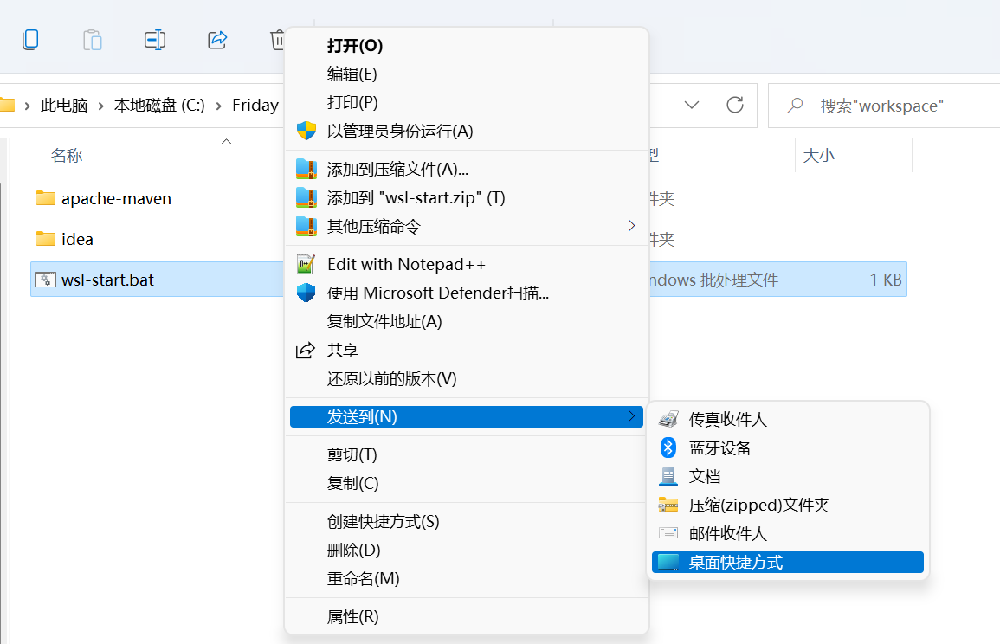
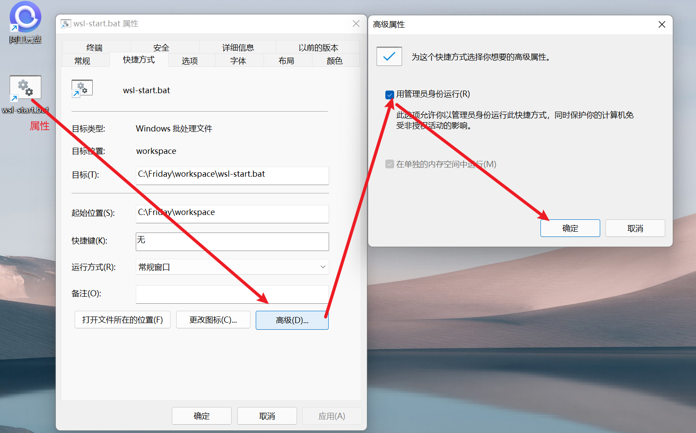
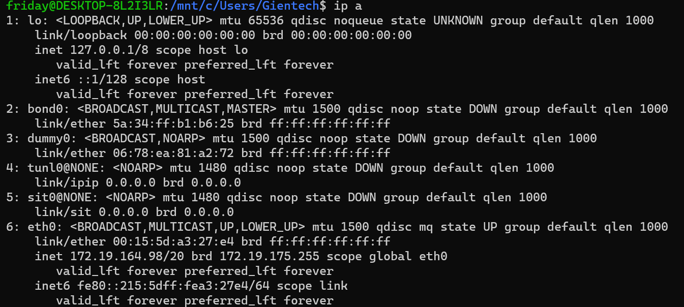
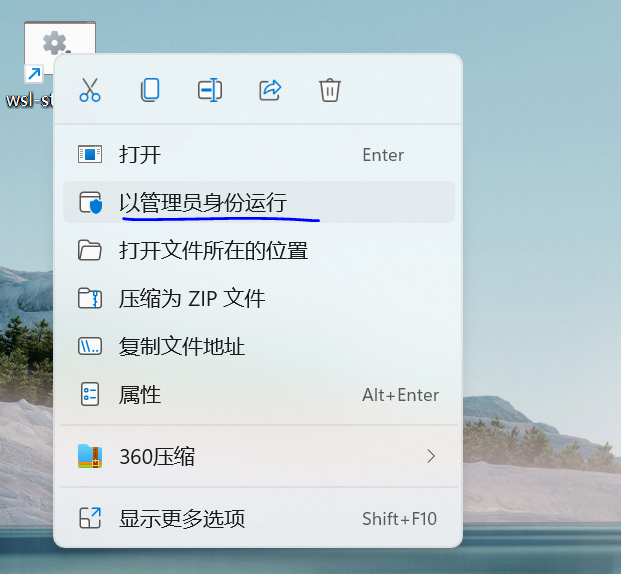
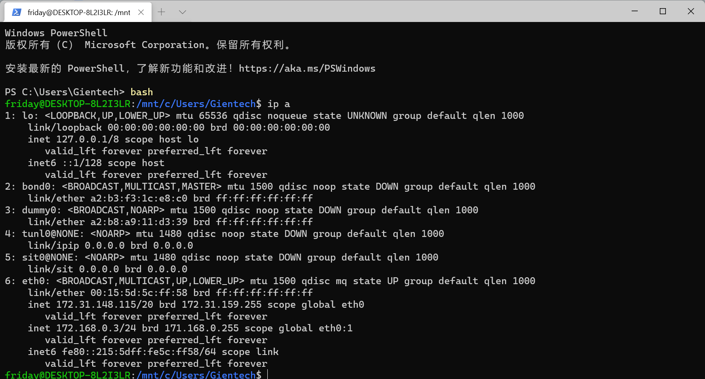
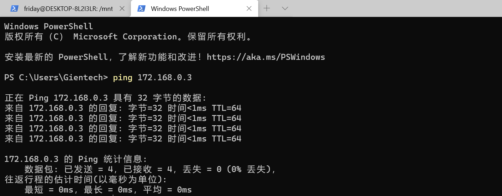

# 背景
WSL2 是由 windows 的 Hyper-V 虚拟平台创建，每次重启 windows 之后 Hyper-V 会重新启动，自然 WSL2 之前设置好的固定ip也会被重置，我们要连接子系统内部的应用频繁换 IP 会很麻烦，可以给 Ubuntu 子系统中添加一个新的网卡来给宿主机连接用。

# 配置固定IP（方法一）

## Step1：查看要配置的子系统
使用命令`wsl -l`看下子系统分发版列表，要配置的是哪个？

```bash
PS C:\Users\Gientech> wsl -l
适用于 Linux 的 Windows 子系统分发版:
Ubuntu-22.04 (默认)
```

## Step2：批处理命令
新建wsl-start.bat文件，添加命令并保存
```bash
:: 在Win11中添加IP地址 172.168.0.2
netsh interface ip add address "vEthernet (WSL)" 172.168.0.2 255.255.255.0

:: 指定发行版子系统，添加一个 eth0:1 网卡，IP 为 172.168.0.3（网段内自己随便设个 IP）
wsl -d Ubuntu-22.04 -u root ip addr add 172.168.0.3/24 broadcast 171.168.0.255 dev eth0 label eth0:1

:: 添加一条防火墙规则允许WSL2对Windows的访问(只能以管理员身份打开PowerShell执行)
:: New-NetFirewallRule -DisplayName "WSL" -Direction Inbound  -InterfaceAlias "vEthernet (WSL)"  -Action Allow
```

## Step3：桌面快捷方式
对Step2中的wsl-start.bat新建桌面快捷方式，并设置管理员运行




## Step4：测试

**① 配置前IP信息** <br />


**② 使用命令`wsl --shutdown` 关闭WSL系统** <br />

**③ 管理员运行wsl-start.bat批处理命令** <br />


**④ 配置后IP信息** <br />

